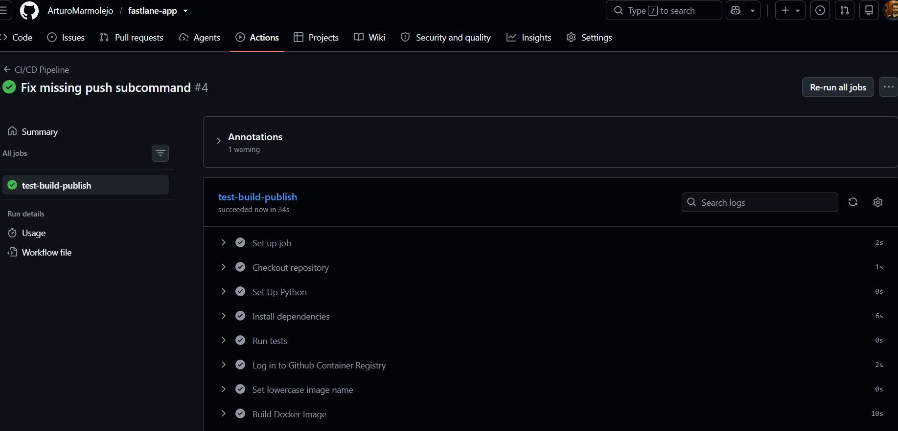
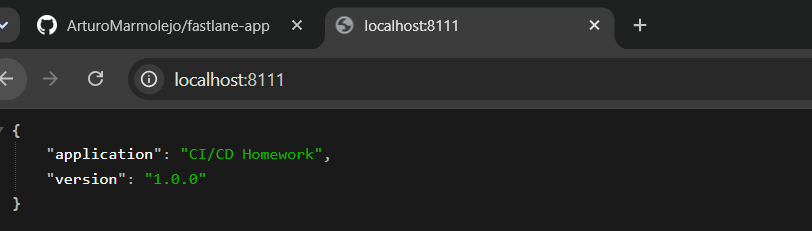
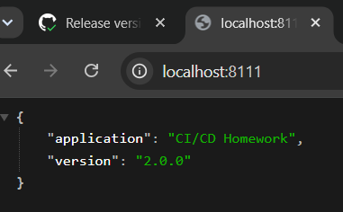

# CI/CD Homework — FastAPI + Docker + GitHub Actions

A small FastAPI application with a GitHub Actions pipeline that tests, builds, and publishes a Docker image to GitHub Container Registry (GHCR) on every push to `main`.

## Repository

https://github.com/ArturoMarmolejo/fastlane-app

## Pipeline overview

Push to GitHub
↓
Run automated test
↓
Build Docker image
↓
Push image to GitHub Container Registry
↓
Run the new image locally


## Project structure

    fastlane-app/
    ├── .github/
    │   └── workflows/
    │       └── ci.yml
    ├── app/
    │   ├── main.py
    │   ├── test_main.py
    │   └── requirements.txt
    ├── Dockerfile
    └── .gitignore


## Running locally

```bash
cd app
pip install -r requirements.txt
pytest
```

## Running with Docker

```bash
docker build -t cicd-homework:local .
docker run -d --name cicd-homework -p 8111:8111 cicd-homework:local
curl http://localhost:8111
```

## Pulling the CI/CD-published image

```bash
docker pull ghcr.io/arturomarmolejo/fastlane-app:latest
docker run -d --name cicd-homework -p 8111:8111 ghcr.io/arturomarmolejo/fastlane-app:latest
```

## Screenshots

### Successful GitHub Actions run



### Application running as version 1.0.0



### Application running as version 2.0.0 (after second pipeline run)


